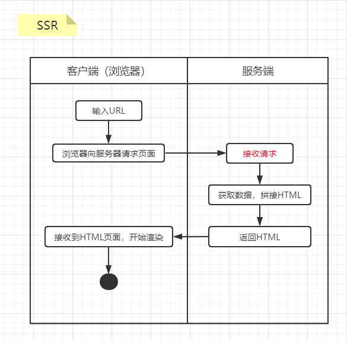
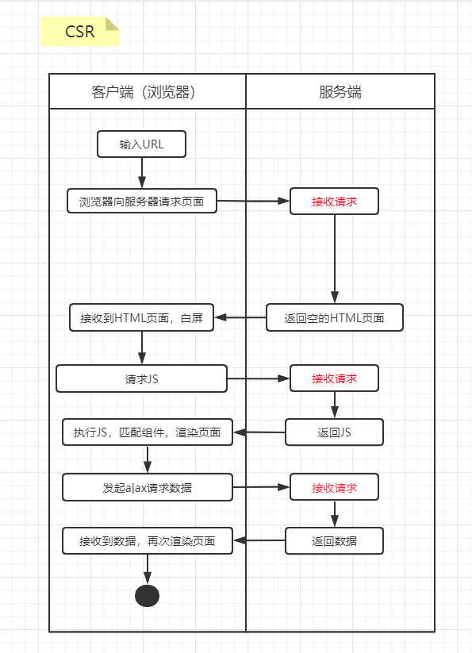
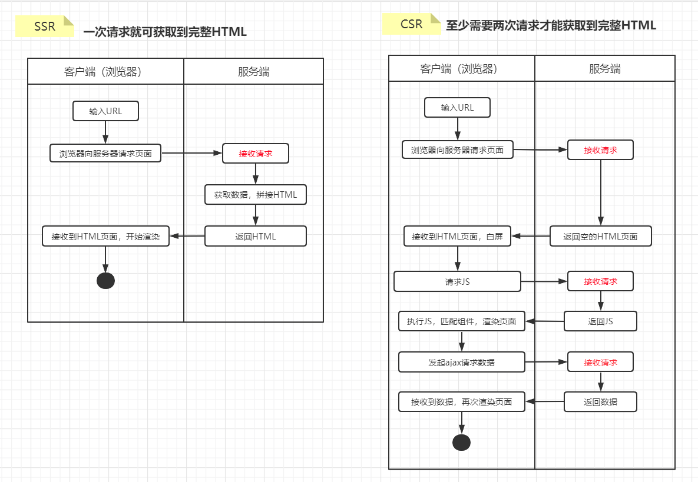
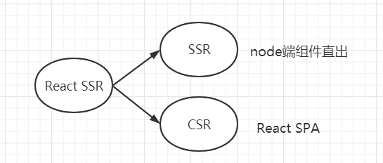
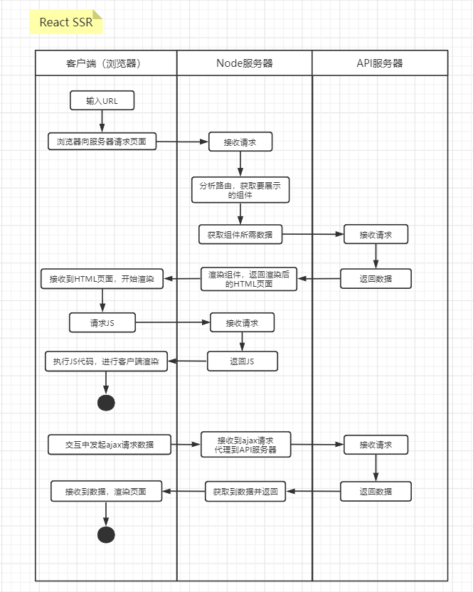
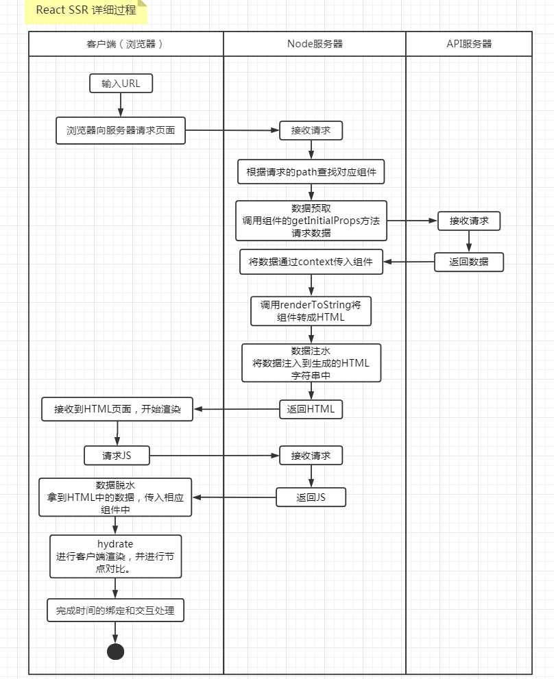

# React SSR基础概念

本文主要分为以下部分：

* SSR vs CSR：对比优缺点，引出React SSR。
* React SSR：了解什么是React SSR，基本实现原理。
* 实践：实现简单的React SSR。
* 总结 & TODO

## 1. SSR vs CSR

### 1.1 SSR

SSR 的全称是Server Side Rendering，也就是将渲染的工作放在服务端进行，由服务器返回给浏览器完整的 html 内容。

浏览器得到完整的结构后就可直接进行 `DOM` 的解析、构建、加载资源及后续的渲染。

**优点：**

1. 首屏较快的展现给用户。
   * 服务端在内网进行请求，数据响应速度快。客户端在不同网络环境进行数据请求，且外网http请求开销大，导致时间差。

   * 服务端渲染是先向后端服务器请求数据，然后生成完整首屏html返回给浏览器；而客户端渲染是等js代码下载、加载、解析完成后再请求数据渲染，等待的过程页面是什么都没有的，就是用户看到的白屏。服务端渲染不需要等待js代码下载完成并请求数据，就可以返回一个已有完整数据的首屏页面。
2. 对搜索引擎比较友好，爬虫可以方便的找到页面的内容，非常有利于SEO。

**缺点：**

1. 所有页面的加载都需要向服务器请求完整的页面内容和资源，访问量较大的时候会对服务器造成一定的压力。
2. 因为返回的是整个页面，页面之间频繁刷新跳转的体验并不是很友好。
3. 前后端耦合严重，前端开发依赖于后端，开发形式上不友好。

### 1.2 CSR

 `CSR`的全称是 `Client Side Rendering`，也就是客户端渲染，是目前 Web 应用中主流的渲染模式。

在CSR中服务端返回的 HTML 页面中没有展示内容`

`，然后由浏览器加载执行JavaScript文件，通过 JavaScript去异步加载数据，渲染生成页面并完成页面交互事件的绑定。

**优点：**

1. 数据渲染都在客户端完成，服务器只需要提供一个返回数据的接口，大大降低了服务器的压力。
2. 页面之间的跳转不会刷新整个页面，而是局部刷新，体验上有了很大的提升。
3. 前后端分离开发。

**缺点：**

1. 首次加载可能有较长的白屏时间。
2. 对 SEO 不友好。由于现阶段大多搜索引擎采用的爬虫算法是直接抓取HTML页面代码分析，而CSR只有一个入口文件而没实质内容，SEO性能差。

### 1.3 两者对比

| 对比要点 | SSR        | CSR        |
| -------------- | ---------- | ---------- |
| 服务器返回数据 | 完整HTML   | 数据       |
| 数据请求       | 内网 服务端发起 | 公网 JS发起ajax请求 |
| 首屏加载       | 快         | 慢         |
| 页面切换         | 整个页面刷新，用户体验差 | 局部刷新，用户体验好     |
| 服务器性能消耗 | 高 | 底  |
| SEO            | 友好       | 基本无法实现   |
| 开发方式       | 前后端耦合 | 前后端分离 |
| 路由         | 服务端控制 | 前端前端 |

[SSR示例网址](https://www.jd.com/)，[CSR示例网址](www.tangeche.com)

## 2. React SSR

### 2.1 概念

SSR 和 CSR 两者各有优缺点：

* SSR由服务器直出HTML：首屏加载快，利于SEO。
* CSR服务器返回数据：降低服务器压力，局部刷新页面提升体验。

最好的方案是两种技术和体检的结合：**第一次打开页面采用SSR，后续用户的交互是 CSR 的效果和体验。**

* 第一次打开页面采用SSR：即由服务器去请求数据并拼接成HTML返回给浏览器。
* 后续用户的交互是 CSR 的效果和体验：即页面加载完成后，后续的交互交给JS处理。由JS控制要展示的组件，发起ajax请求数据。

### 2.2 实现原理

把页面的展示内容和交互写在一起，让代码执行两次。

* 在服务器端执行一次，用于实现服务端渲染。使得浏览器下载的 HTML 已经包含了所有的页面展示内容。
* 在客户端再执行一次，用于接管页面交互。为 HTML 网页中的内容添加数据及事件的绑定。

#### 2.2.1 同构

React SSR 的核心就是同构，没有同构的 ssr 是没有意义的。

同构：采用一套代码，构建双端逻辑，最大限度的重用代码，不用维护两套代码。而传统的服务端渲染是无法做到的，react 的出现打破了这个瓶颈。

#### 2.2.2 语言优势

一套代码在两端运行，就需要两端使用同一种语言。 JavaScript既可以在浏览器上运行，又可以在 Node 环境下运行。

#### 2.2.3 虚拟DOM

虚拟DOM是组件可以在服务端渲染的根本原因。

我们平常写的 jsx 看上去就像在写 html（其实写的是对象） 标签，其实经过编译后都会转换成`React.createElement`方法，最终会被转换成一个对象(虚拟DOM)。React中的虚拟DOM本身就是一个内存中的对象，可以轻松的把这个对象转换我们想要的表现形式，比如html格式。

在服务器端把虚拟 DOM 映射成HTML字符串输出；在客户端将虚拟 DOM 映射成真实 DOM，完成页面挂载。

## 3. 实践

React SSR的核心概念就是同构，同一份代码在Node端和浏览器端都执行一遍。Node能执行ES语法的JS，但并没有DOM，BOM的概念。因为浏览器环境和Node环境是有差异的，所以要在代码中处理因运行环境差异带来的问题。

### 3.1 在服务端渲染React组件（hello world）

**操作步骤：**

1. 编写一个React组件
2. 搭建一个Node服务（Koa）
3. 使用react-dom/server的renderToString方法将React组件渲染成字符串（data-reactroot）。
4. 编译代码（babel）
5. 运行服务

### 3.2 实现交互

#### 3.2.1 上一个demo无法实现交互

元素事件是基于浏览器执行的，只有在浏览器端执行了相应的js代码才能绑定事件。而上个demo仅仅是在Node端输出一个静态页。

所以我们需要让代码在浏览器端也执行一次，组件在浏览器端挂载完后react会自动完成事件绑定。**即将前端代码打包成一个JS文件，并塞进Node端输出的HTML页面**。浏览器在处理解析Node返回的HTML时，遇到script会去下载并执行该JS，完成事件绑定。

#### 3.2.2 操作步骤

1. 给组件添加点击事件。
2. 添加浏览器端渲染入口文件。
3. 将代码打包编译到dist/static中（webpack）。
4. 将dist/static作为静态资源目录，提供访问（koa-static）。
5. 在Node端将组件转成HTML并引入打包好的JS。
6. 编译Node端代码（babel）。
7. 运行服务

#### 3.2.3 浏览器也执行一次代码，组件不会重复渲染吗？

浏览器接管页面后，react-dom在渲染组件前会先和页面中的节点做对比，只有对比失败的时候才会采用客户端的内容进行渲染，且react会尽量多 的复用已有的节点。

以上功能由react-dom的hydrate方法提供。hydrate是 React 中提供在初次渲染的时候，去复用原本已经存在的 DOM 节点，减少重新生成节点以及删除原本 DOM 节点的开销，来加速初次渲染的功能。

### 3.3 路由同构

在服务端需要通过请求路径，找到路由组件；而在客户端需通过浏览器中的网址，找到路由组件。那么React SSR要如何实现路由跳转呢？

**实现思路：**

1. 当第一请求页面的时候，Node端接收请求，根据当前的path来查找具体的路由，然后根据路由得到具体的组件，然后将组件直出。
2. Node端直出后，页面由浏览器接管，后面的渲染执行就交给前端代码了。

**实现要点：**

1. 客户端路由和我们平常开发一样。
2. Node端使用react-router提供的[StaticRouter](https://react-router.docschina.org/web/guides/server-rendering)组件。该组件主要用于服务端渲染，可以帮助我们完成路由查找功能，无需再做手动匹配。

**操作步骤：**

1. 编写3个组件。
2. 实现前端路由（BrowserRouter）。
3. 服务器端路由处理（StaticRouter）。
4. 编译并运行服务

### 3.4 CSS资源处理

组件会在双端构建，客户端和Node端都需要进行相关配置处理解析样式。

**客户端配置：**

* sass-loader: 将SCSS转成CSS。
* postcss-loader: 结合autoprefix自动添加浏览器前缀。
* css-loader: 解析CSS代码，主要是为了处理CSS中的依赖。
* mini-css-extract-plugin：将CSS提取为独立的文件。
* file-loader: 用于处理图片。

**Node端配置：**

Node端如果也配置了相关的loader，那么css代码也会被打包进JS文件中，就成了多余的无效代码。

可以使用ignore-loader忽略掉样式文件的引入，然后在Node端直出的HTML中引入样式文件。

**操作步骤：**

1. 编写样式，并引入。
2. 给客户端webpack配置相应loader。
3. 在Node端webpack配置中使用ignore-loader，忽略样式。
4. 在Node端直出的HTML中，引入第2步输出的样式文件。
5. 编译并运行服务

### 3.5 数据同构

前面实现的组件直出只是将组件转换为了HTML字符串，但是并没有具体的数据，顶多就是个静态页。

#### 3.5.1 componentDidMount只在浏览器端运行

在CSR项目开发中我们一般都将数据的数据的请求处理放在`compoentDidMount`生命周期内，得到数据后更改状态，随之渲染。这样能渲染出数据，但右键查看源码会发现HTML并不包含数据部分。无法实现SEO优化。

导致上面这种情况的原因是componentDidMount只在浏览器端运行，Node端再将组件转成HTML字符串时，没有数据。

所以需要在Node端将组件转成HTML字符串前，先获取到数据，然后将数据作为props传给组件再转成HTML字符串。这个过程就是数据预取。

#### 3.5.2 数据预取

JS里无论是函数还是类，本质都是函数，同时都是特殊的对象。所以我们可以为这些函数添加属性，这个属性也可以被称作为类的静态方法，不需要实例化就可以访问。

我们可以给组件定义一个getInitialProps静态方法，在这个方法中请求并返回数据。在Node端找到这个路由对应的组件，然后调用这个组件的静态方法来实现数据的预取。

#### 3.5.3 数据脱水注水

**问题1：页面怎么闪了下就没数据了？**

Node端直出的HTML包含了数据，但客户端没有取数据。所以在客户端渲染时，react对比两端结构不一致，采用了客户端的。
在componentDidMount内请求数据。

**问题2：如何避免重复请求数据？**

服务端渲染和客户端渲染都请求了同一份数据，多余。
将Node端获取到的数据，插入到HTML中。然后在客户端渲染入口文件中，将数据注入到相应组件中。

**问题3：切换到其他页面刷新，再进入当前页后怎么数据消失了？**

首次进入页面走服务端渲染，后续是客户端渲染。数据只能在服务端渲染模式下才能拿到，如果是客户端渲染就拿不到了。

可以再componentDidMount中判断下是否有Node端注入的数据，没有的话就发起请求。

#### 3.5.4 整体思路

关键步骤如下:

- 方法同构：为组件声明getInitialProps静态方法，这是一个同构方法，用于双端的数据获取。
- 数据预取：在Node端通过路由匹配找到目标组件，然后调用组件的数据预取方法得到数据。
- 将初始化数据作为属性传递给组件。
- 数据注水：将数据和 html字符串一起直出返回给浏览器端。
- 数据脱水：浏览器端得到Node端直出的数据，也通过属性将数据传给组件。
- 如果初始化数据不存在，则可以在componentDidMount生命周期内请求一次数据。

## 4. 总结

| 对比要点       | SSR  | CSR          | React SSR                                      |
| -------------- | ---- | ------------ | ---------------------------------------------- |
| 首屏加载速度   | 快   | 慢           | 快                                             |
| SEO            | 友好 | 基本无法实现 | 友好                                           |
| 服务器性能消耗 | 高   | 底           | 中等                                           |
| 用户体验       | 差   | 好           | 好                                             |
| 项目复杂度     | 中等 | 底           | 高 出问题需要在前端、node、后端三者之间找 |

React SSR的核心概念就是同构，一份代码在两端执行。

Node端只负责首次“渲染”（实际上，只有浏览器才能渲染页面，服务端其实是生成 HTML 内容），然后返回给客户端，客户端接管页面交互（事件绑定等逻辑），之后客户端路由切换时，直接通过 JS 代码来显示对应的内容，不再需要服务端渲染（只有页面刷新时会需要）。

**TODO**

- next.js：新项目
- 预渲染：旧项目

